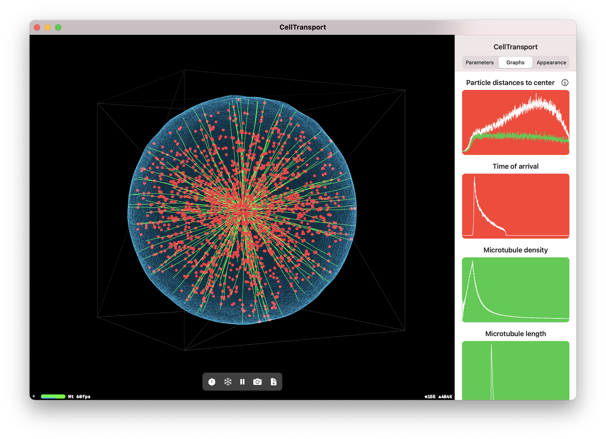

# CellTransport

Metal simulation (GPU) to study intracellular transport by diffusion and active transport through microtubules. Particles diffuse freely through the cell and have a probability to attach and detach to microtubules when in close contact to them. When particles diffuse outside the cell membrane they are automatically reinjected into the centrosome (innermost part of the cell) to provide a easy contour condition for the study. Collisions can be enabled and disabled (even in real time) to study the effect of excluded volume.

Data in the histograms can be exported to a .txt for further analysis in Python or other languages. A separate Parameters.txt file is also exported with the histogram data reflecting the parameters being used for the simulation. A list of those parameters can be found below.

## Parameters
Parameter | Explanation
------------ | -------------
**Number of biological cells** | Number of biological cells being simulated in parallel.
**Particles per cell** | Number of particles (organelles) whose dynamics (diffusion, microtubule transport) are being simulated for each biological cell. These particles can interact with each other if they're inside the same biological cell and collisions are enabled.
**Microtubules per cell** | Number of microtubules on each biological cell. Particles can attach and travel through these microtubules towards the cell membrane.
**Cell radius** | Cell radius, in nanometers. Particles will be reinjected in the centrosome if found outside this radius.
**Centrosome radius** | Centrosome radius, in nanometers. Particles are reinjected here.
**Microtubule speed** | Speed at which particles travel through the microtubules, in nanometers per second.
**Microtubule segment lenght** | Segment length of the microtubules. These segments are straight but the angle at which they join is randomly varied to build a realistic microtubule. Several segments are joined to form a full microtubule. Particles have a probability of attaching to every **segment** in their vicinity.
**Microtubule local angle** | Maximum angle at which new microtubule segments can join the previous segment. In radians.
**Microtubule max local angle** | Maximum angle at which new microtubule segments close to the cell membrane can join the previous segment. In radians.
**Microtubule max segments** | Maximum number of segments that can be joined to form a full microtubule. Segments are added to a forming microtubule upon generation until either the cell membrane is reached or the microtubule max segments count is reached.
**Molecular motors** | Wether the simulation is using *KINESIN_ONLY* (outward traveling motors) or *DYNEIN_ONLY* (inward traveling motors).
**Boundary conditions** | Wether the simulation is using *REINJECT_INSIDE* (particles further than the cell membrane are reinjected in the centrosome), *REINJECT_OUTSIDE* (particles in the centrosome are reinjected in the cell membrane or *CONTAIN_INSIDE* (particles are not reinjected anywhere and can't travel outside the cell membrane).
**Collisions enabled** | Wether or not collisions (excluded volume) is enabled.
**Attachment probability** | Factor of the probability of diffusive particles to attach to microtubules, in *nm3s-1*.
**Detachment probability** | Factor of the probability of transported particles to detach from microtubules, in *s-1*).
**Timestep** | Timestep used for the simulation.
**Cells per dimension** | Number of spatial cells in which the space is subdivided on each dimension. Only used internally (non-biological meaning), but is related to the volume the particles have in collisions (there can only be one particle on each of these cells).

## Compatibility
Works in macOS 10.15 or later and iOS 13 or later. Requires a Metal-compatible graphic card.
